2016 week 24: Microsoft gender disparities
================

Data exploration
----------------

    ## Classes 'tbl_df', 'tbl' and 'data.frame':    12 obs. of  4 variables:
    ##  $ Year  : Factor w/ 2 levels "2012","2015": 1 2 1 2 1 2 1 2 1 2 ...
    ##  $ Level : Factor w/ 6 levels "Entry Level",..: 1 1 2 2 3 3 4 4 5 5 ...
    ##  $ Female: num  0.42 0.45 0.33 0.37 0.28 0.32 0.23 0.27 0.2 0.23 ...
    ##  $ Male  : num  0.58 0.55 0.67 0.63 0.72 0.68 0.77 0.73 0.8 0.77 ...

The data consist of the gender distribution of Microsoft employees at 6 job categories in 2012 and 2015.

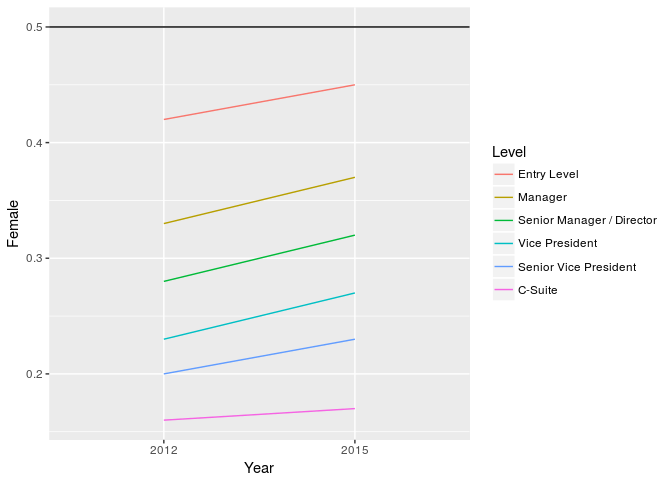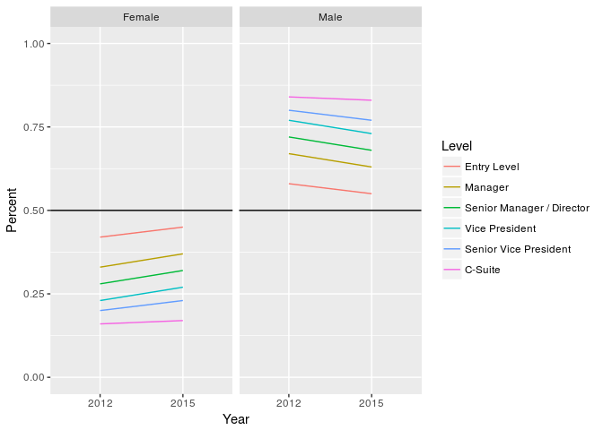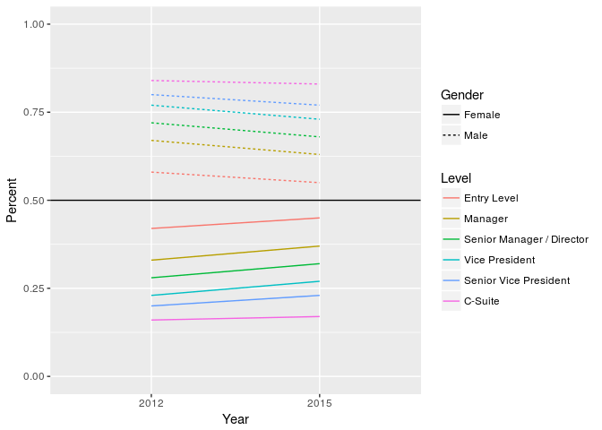

More employees are male at every job category in both years. The difference grows larger with the seniority of the position. The female fraction increased from 2012 to 2017 in all cases, albeit modestly. The maximum female representation is 45% in entry level positions in 2015 and the minimum is a staggering 17% in the highest-level executive positions in 2015 (up from 16% in 2012).

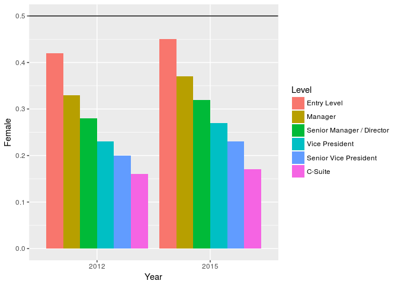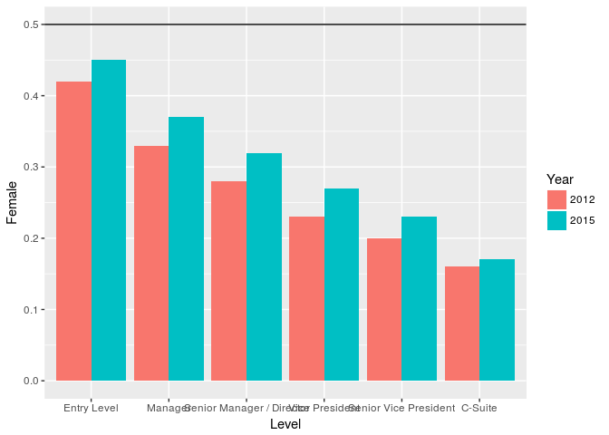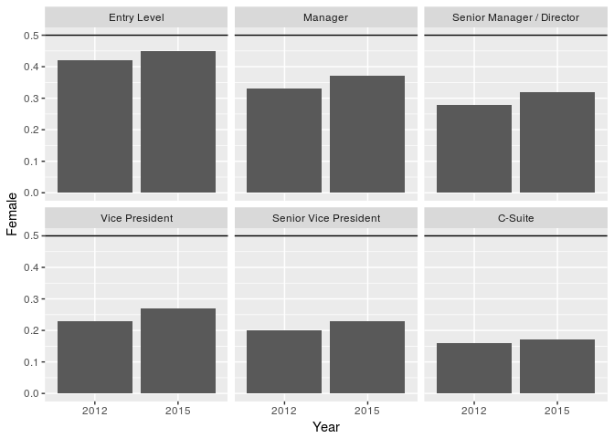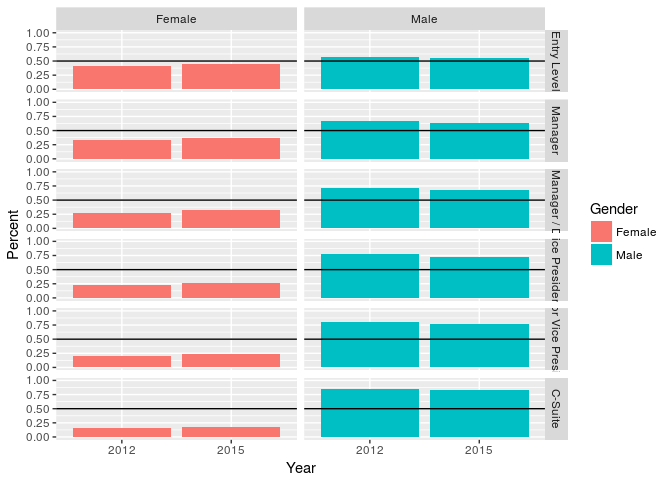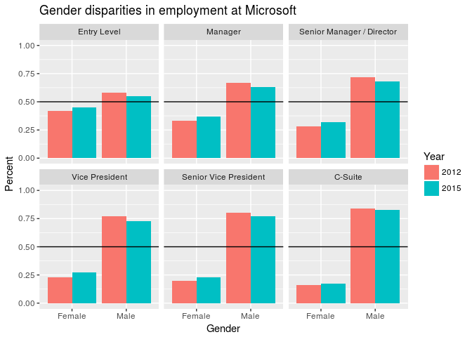

I like this last plot, which clearly indicates the stark differences in gender representation at every level of employment. It shows the improvements that were made between 2012 and 2015 in the context of those large gender differences, so the viewer can see that though progress was made, it is quite small compared to the differences that exist.

While I like the plot, it is relatively complex and busy for showing just a few numbers, so I feel that a more efficient display is possible.

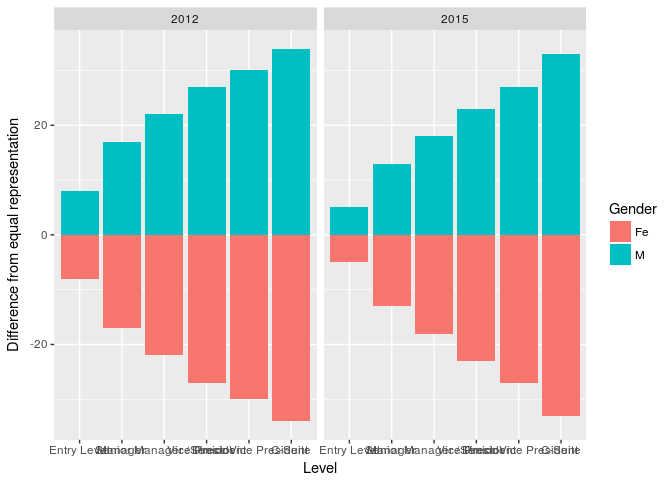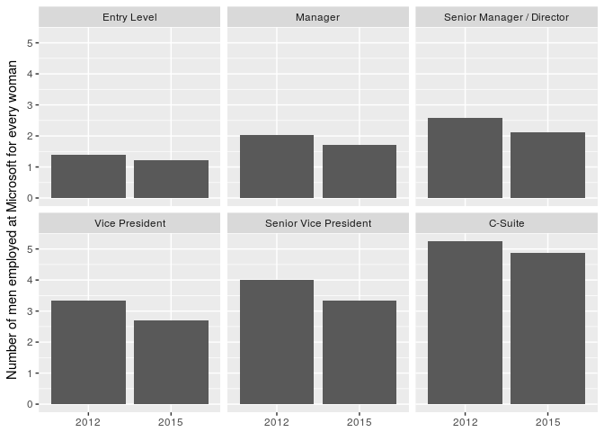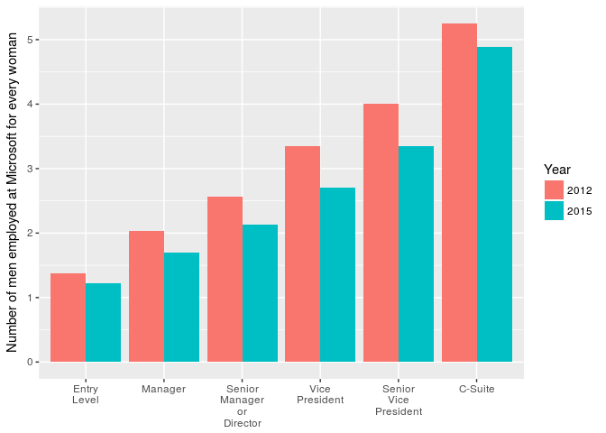

I really like this transformation of the data into number of men employed for every woman, which puts into quite concrete terms the scale of the differences. Before, we could observe a large gap in the percentages for each gender, but the meaning of an 80:20 ratio is not as concrete to me as imagining a meeting of 5 people where 4 are men and 1 is a woman.

This transformation also cuts down the number of bars to be shown by half (though to be fair, you could also show just the percentages for one gender since the other is just the difference from 100).

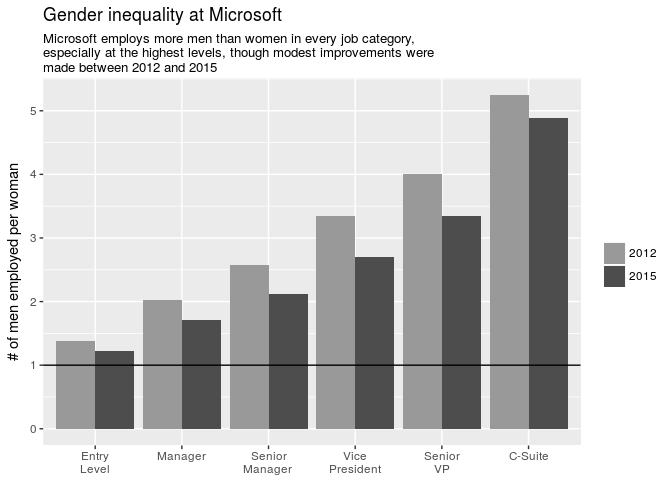
