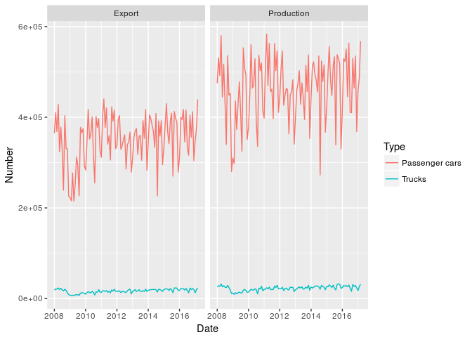
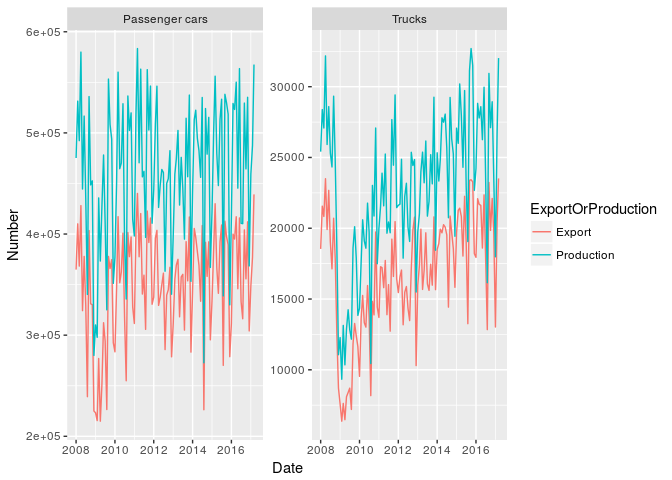
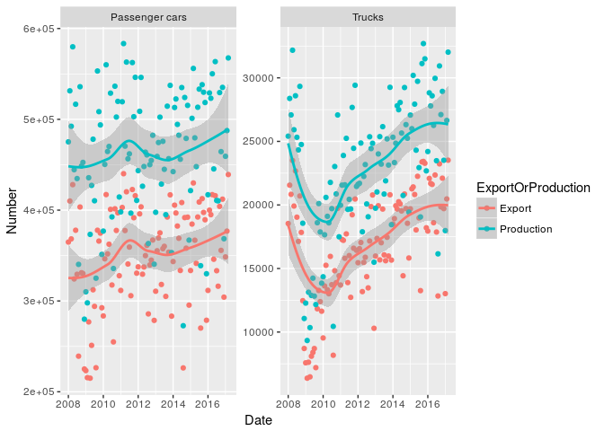
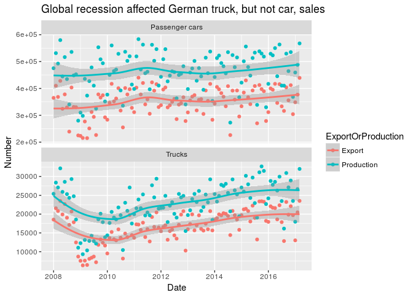
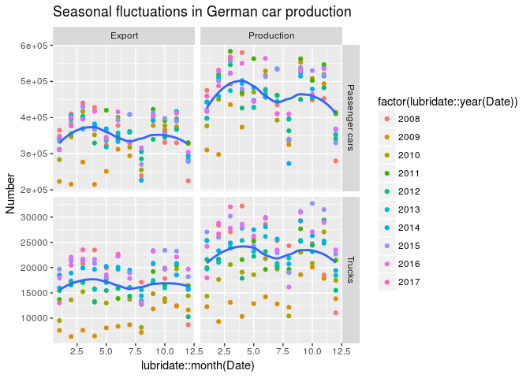
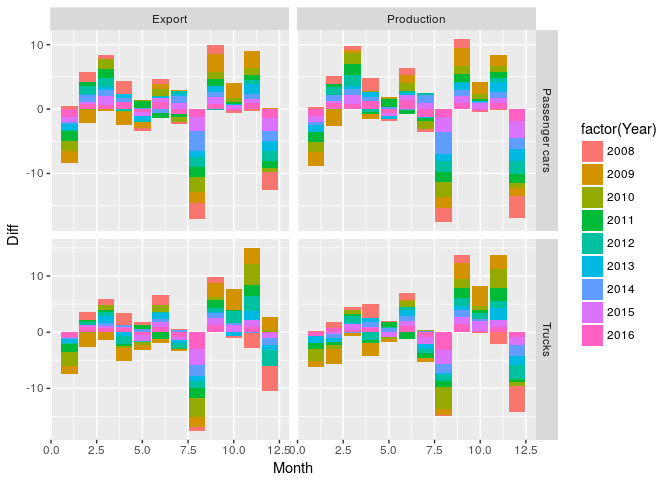
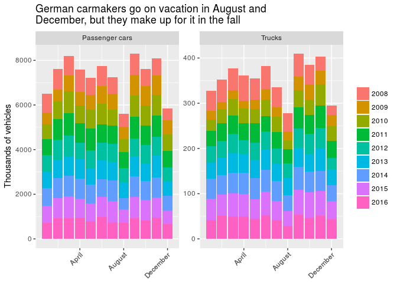

2017 week 26: German car exports
================

It's week 26 of [Makeover Monday](http://www.makeovermonday.co.uk/data/) 2017 edition. The data this week is about car production in Germany and comes from [VDA](https://www.vda.de/en/services/facts-and-figures.html).

Data exploration
----------------

    ## `geom_smooth()` using method = 'loess'

    ## `geom_smooth()` using method = 'loess'

    ## `geom_smooth()` using method = 'loess'

