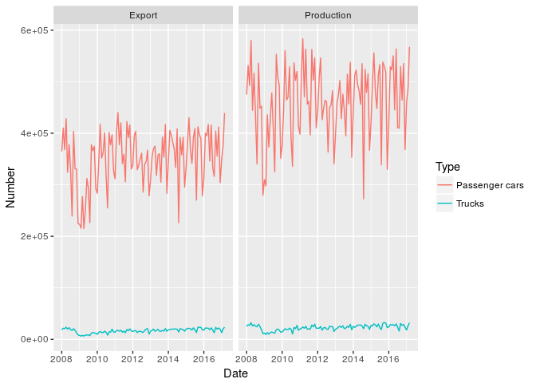
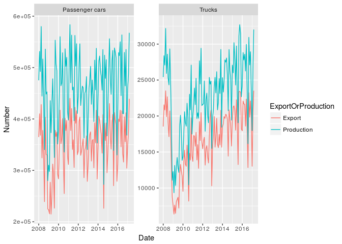
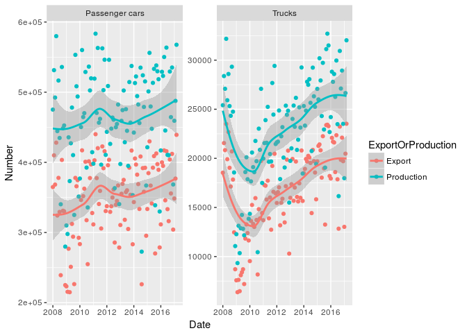
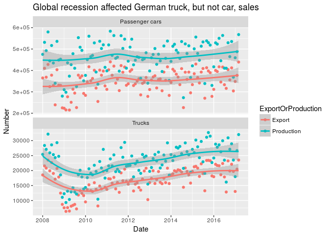
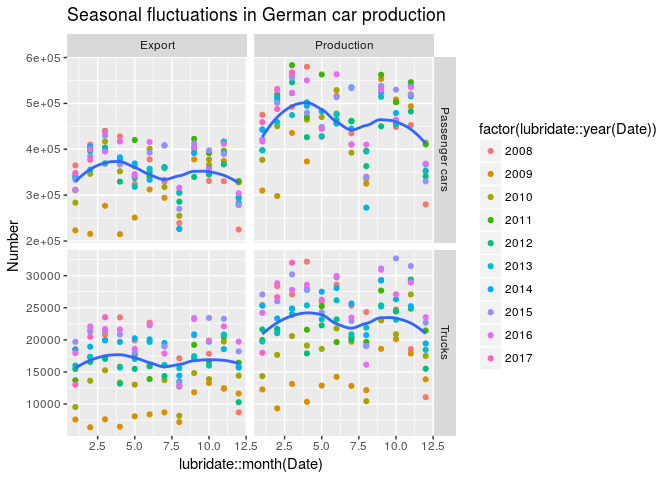
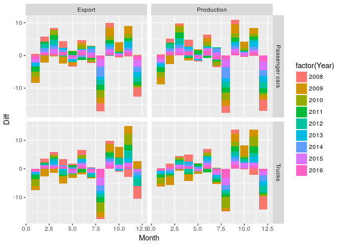
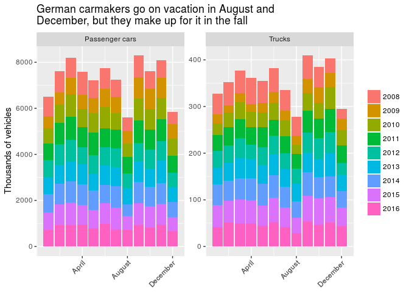

2017 week 26: German car exports
================

Data exploration
----------------

    ## `geom_smooth()` using method = 'loess'

    ## `geom_smooth()` using method = 'loess'

    ## `geom_smooth()` using method = 'loess'

