2017 week 27: German tourism
================

summary by country of origin
----------------------------

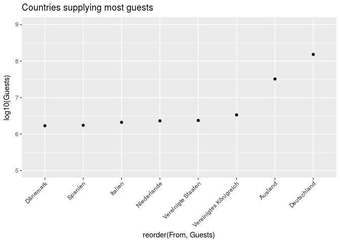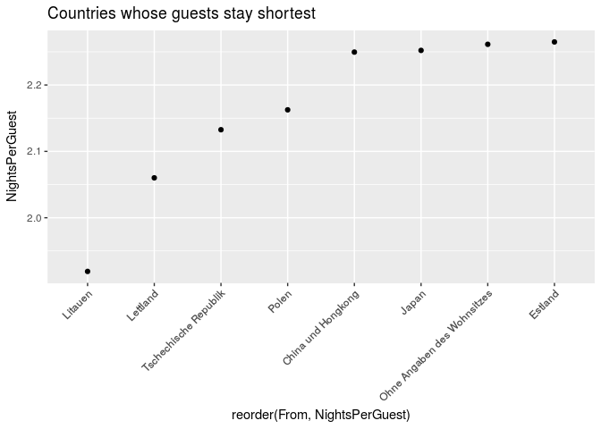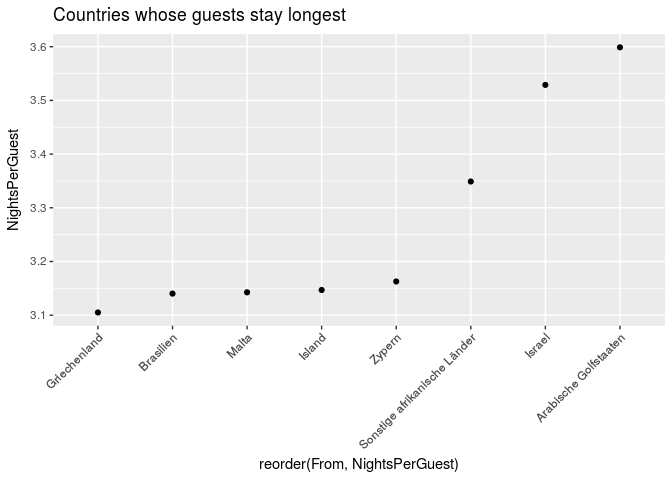

I started out just looking at the top and bottom few. Then I started showing all the data and just labeling the top and bottom few, which is way better.

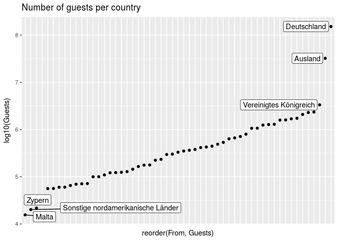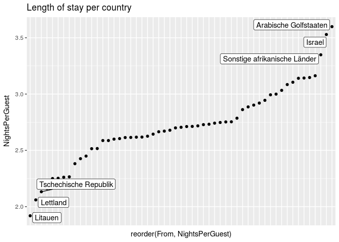

summary by district visiting
----------------------------

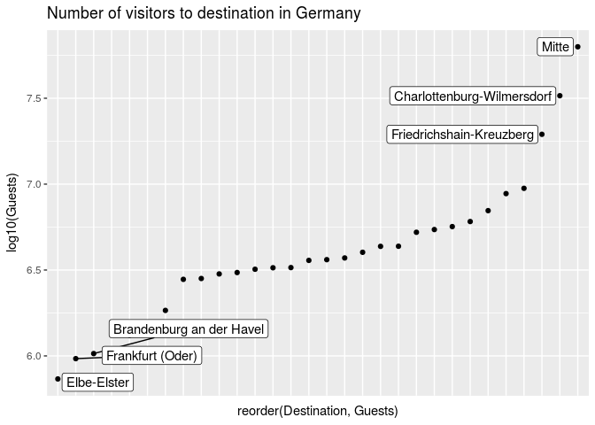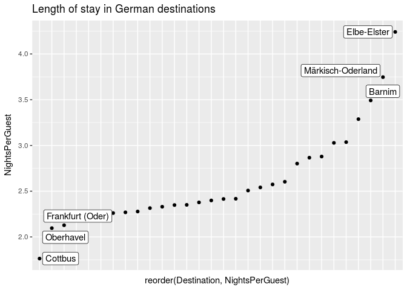

Seasonal variation
------------------

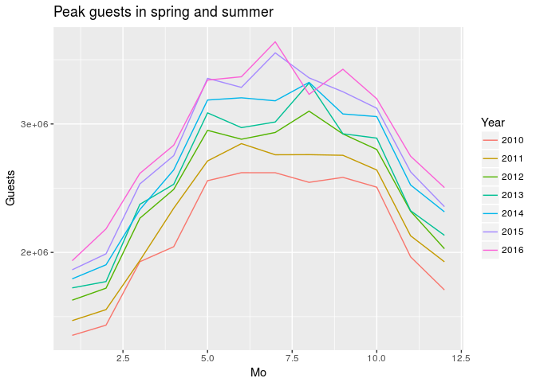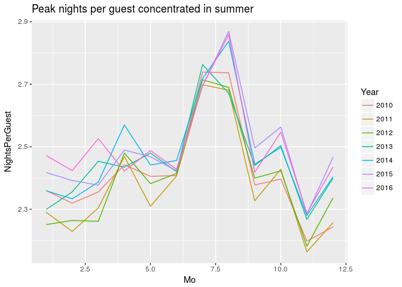

where do biggest visitors go
----------------------------

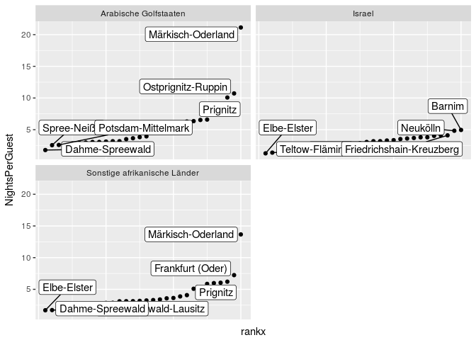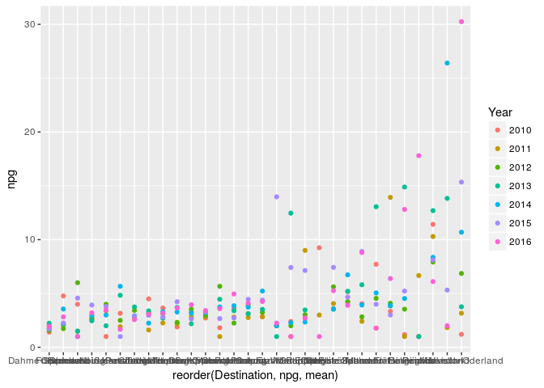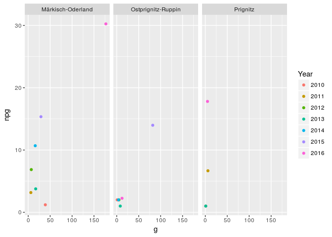

where and when to go for most/fewest other tourists?
----------------------------------------------------

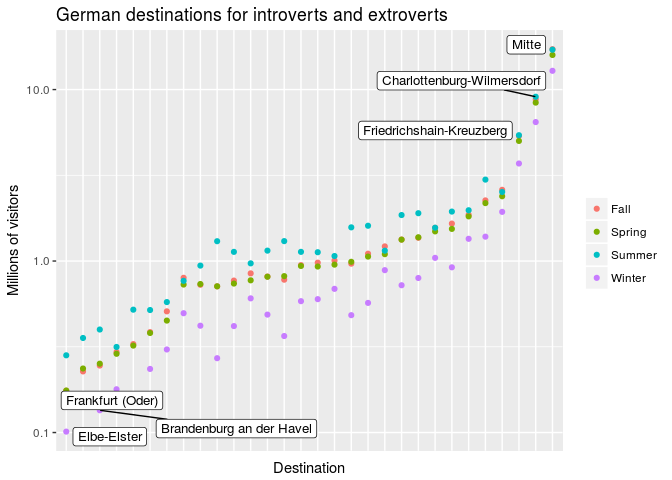
