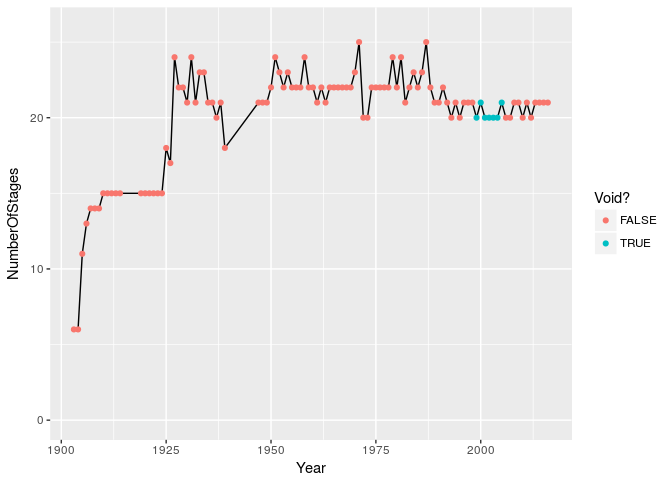
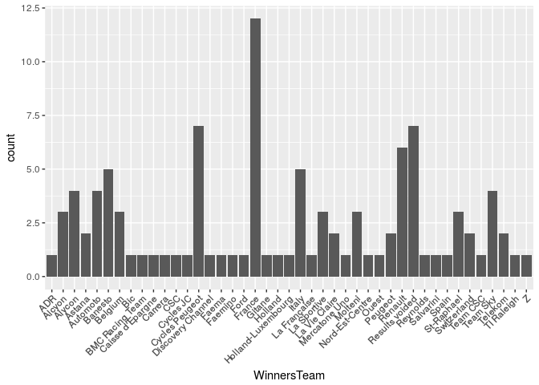
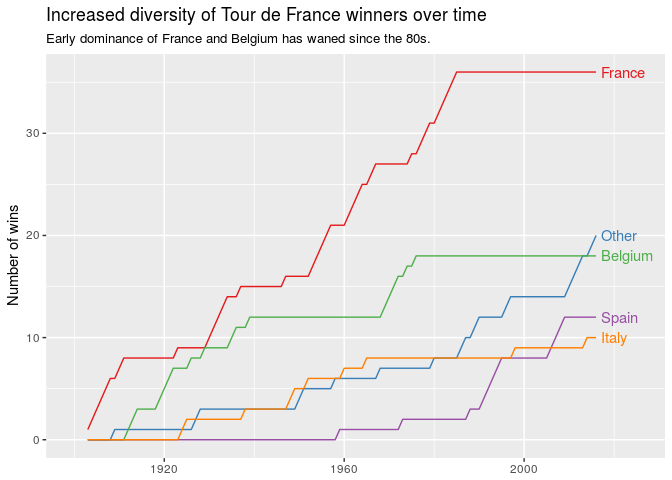

2017 week 28: Tour de France
================

Change over time
================

Country and team summaries
==========================

    ## # A tibble: 14 x 3
    ##    WinnersNationality LastWin Number
    ##                 <chr>   <dbl>  <int>
    ##  1             France    1985     36
    ##  2            Belgium    1976     18
    ##  3              Spain    2009     12
    ##  4              Italy    2014     10
    ##  5     Results voided    2005      7
    ##  6         Luxembourg    2010      5
    ##  7     United Kingdom    2016      4
    ##  8                USA    1990      3
    ##  9        Netherlands    1980      2
    ## 10        Switzerland    1951      2
    ## 11          Australia    2011      1
    ## 12            Denmark    1996      1
    ## 13            Germany    1997      1
    ## 14      Ireland Irish    1987      1

    ## Joining, by = c("Year", "Country")

