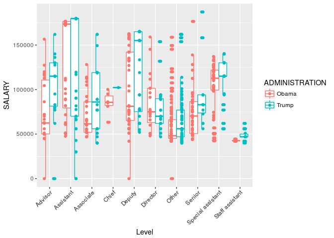

2017 week 29: White House salaries
================

It's week 29 of [Makeover Monday](http://www.makeovermonday.co.uk/data/) 2017 edition. This week the data is a comparison of White House employee salaries between the Obama and Trump administrations. The data comes from [NPR](https://docs.google.com/spreadsheets/d/119OjfVU9Uf0lqfwu8VCjKsD73dMb5owmai5Nec1OFBI/edit#gid=0), which wrote about the topic [here](http://www.npr.org/2017/06/30/535069910/trump-white-house-staff-payroll-nearly-36-million-and-top-heavy).

I struggled a lot with this one.

Initial data exploration
------------------------

Obama had more employees. Trump has fewer, who make, on average, more than the Obama employees, presumably because he has filled mainly higher level positions.

    ## # A tibble: 2 x 4
    ##   ADMINISTRATION     n     mean median
    ##            <chr> <int>    <dbl>  <dbl>
    ## 1          Obama   472 84223.62  73051
    ## 2          Trump   377 94872.00  89000

There are a ton of unique position titles. Can we put them in groups?

Gender
------

I decided to compare the genders of WH staffers and see if they got paid differently. To do this, I matched the first names of the staffers to a US database. If more than 75% of the people in the database with that name were one gender, I assigned that person that gender. If the name wasn't in the database or it was a more mixed-gender name (&lt;75%), I looked the person up manually. This analysis unfortunately cannot account for transgender individuals as a separate category, so they get categorized according to the gender of their name.

    ## Joining, by = "FirstName"

    ## Joining, by = "NAME"

Overall, average salaries seem higher for men than women, especially in the Trump WH. Why?

    ## Warning in max(data$density): no non-missing arguments to max; returning -
    ## Inf

It looks to me like the difference in average salaries between men and women in the Trump admin are due to more men being employed in higher-wage positions, rather than men getting paid more than women who are in their same job category.

Indeed, many more men than women in the higher wage positions than in the lower wage buckets.
