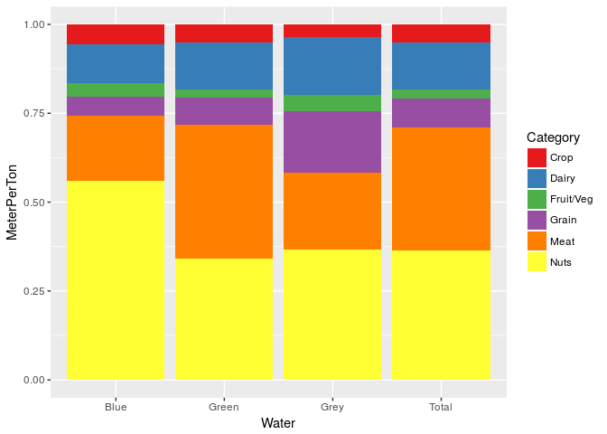
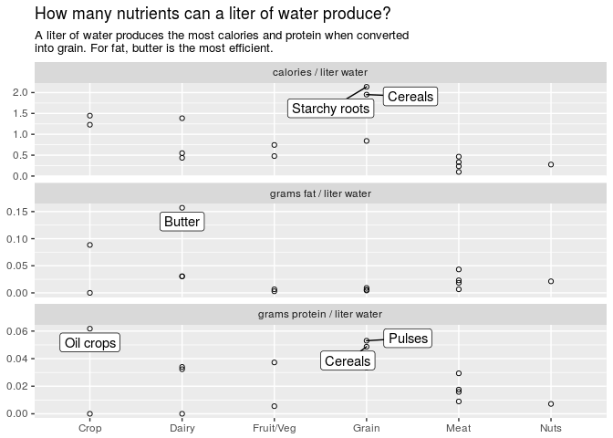

2017 week 30: Water footprints
================

It's week 30 of [Makeover Monday](http://www.makeovermonday.co.uk/data/) 2017 edition. The data comes from [UNESCO](http://waterfootprint.org/media/downloads/Report-48-WaterFootprint-AnimalProducts-Vol1.pdf), and was covered [here](https://www.statista.com/chart/9483/how-thirsty-is-our-food/).

Initial data exploration
------------------------

Most of the water used is green. There are too many groups to tell much about the groups.

    ## Joining, by = "Food"

    ## Warning: Column `Food` joining character vector and factor, coercing into
    ## character vector

Total water consumption from highest to smallest (per ton of product produced): meat, nut, dairy, grain, crop, and then fruit/veg. (average of all foods in the category)

Total water consumption per unit calorie/fat/protein is harder to interpret. Some foods 0 units of particular nutrients (e.g. butter has 0 g protein), so those foods are removed from this plot.

Maybe a better way to think about it is: how many units of nutrient can I get per cubic meter of water?

Too much noise with some foods having very little use of one particular kind of water.

Colors overwhelming but this is okay otherwise. Incidentally, I realized that the last three columns of the data are liter of water per unit nutrient (g fat/g protein/kcal), which is the inverse of the number I just came up with. I could have just used those columns, except that for cases where there is 0 of that unit, the numbers are off.

    ## Warning: Removed 39 rows containing missing values (geom_label_repel).

    ## Warning: Removed 39 rows containing missing values (geom_label_repel).
