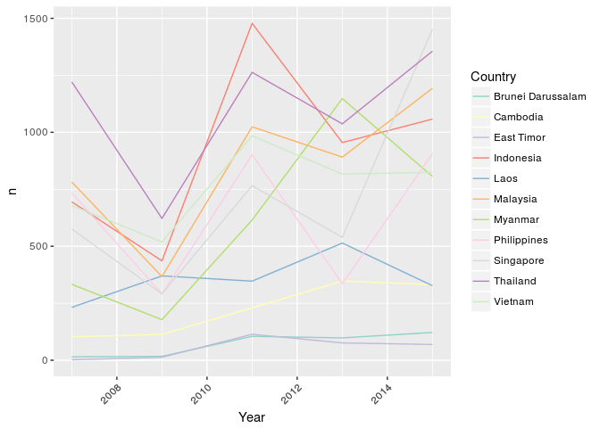
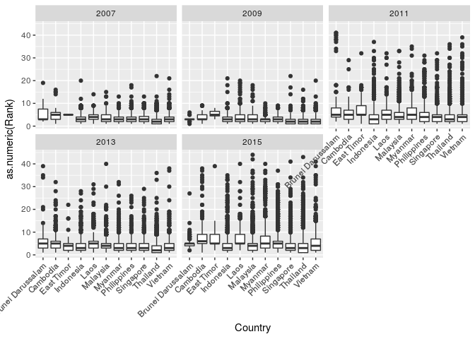
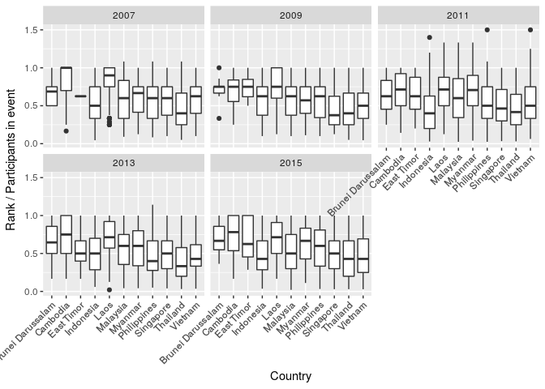
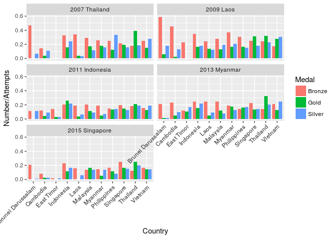
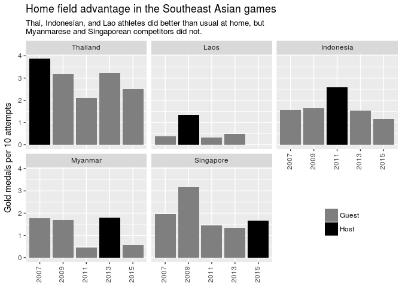
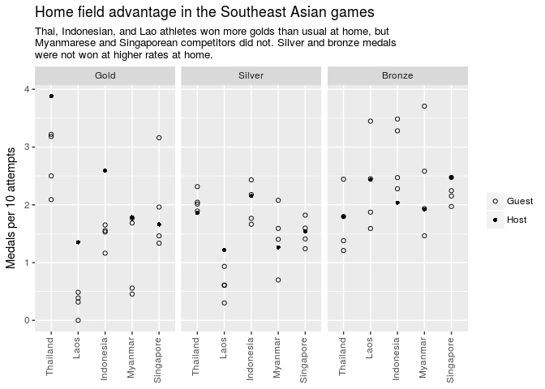

2017 week 31: Southeast Asian Games
================

It's week 31 of [Makeover Monday](http://www.makeovermonday.co.uk/data/) 2017. The data comes from [Sport Singapore](https://www.myactivesg.com/sea-games-asean-para-games/28th-sea-games-singapore-2015).

Statistics about the games:

    ## # A tibble: 5 x 8
    ##    Year      Host NAgeBrackets NSports NEventTypes NNationalities
    ##   <dbl>     <chr>        <int>   <int>       <int>          <int>
    ## 1  2007  Thailand            2      55         266             12
    ## 2  2009      Laos            1      33         200             14
    ## 3  2011 Indonesia            1      61         298             14
    ## 4  2013   Myanmar            1      45         269             14
    ## 5  2015 Singapore            2      46         214             16
    ## # ... with 2 more variables: NCountries <int>, NAthletes <int>

Performances in the top n in the world:

    ## # A tibble: 5 x 6
    ##    Year      Host Top10 Top50 Top100 TotalRank
    ##   <dbl>     <chr> <int> <int>  <int>     <int>
    ## 1  2007  Thailand     0     0      0         0
    ## 2  2009      Laos     0     0      0         0
    ## 3  2011 Indonesia     0     0      0         0
    ## 4  2013   Myanmar    25   272    465       521
    ## 5  2015 Singapore    31   628    958      1136

Countries of participants: 

    ## Warning in fun(x, ...): NAs introduced by coercion

    ## Warning in FUN(X[[i]], ...): NAs introduced by coercion

    ## Warning: Removed 339 rows containing non-finite values (stat_boxplot).

    ## Warning in fun(x, ...): NAs introduced by coercion

    ## Warning in FUN(X[[i]], ...): NAs introduced by coercion

    ## Warning: Removed 339 rows containing non-finite values (stat_boxplot).

No country seems to dramatically dominate. It sort of looks like host countries do better, is that true?

