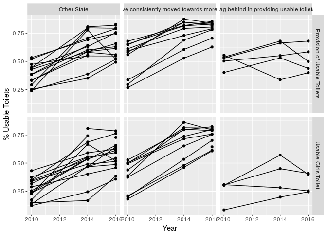
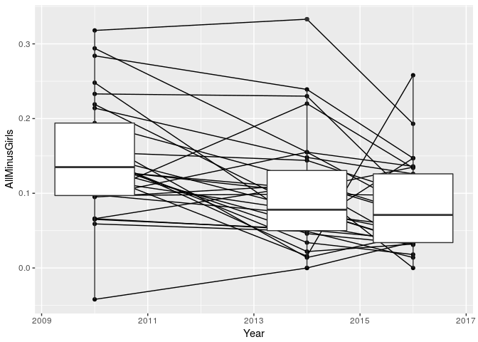
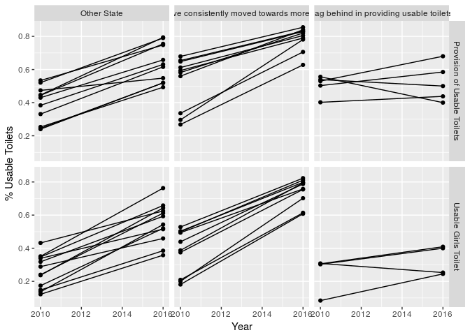
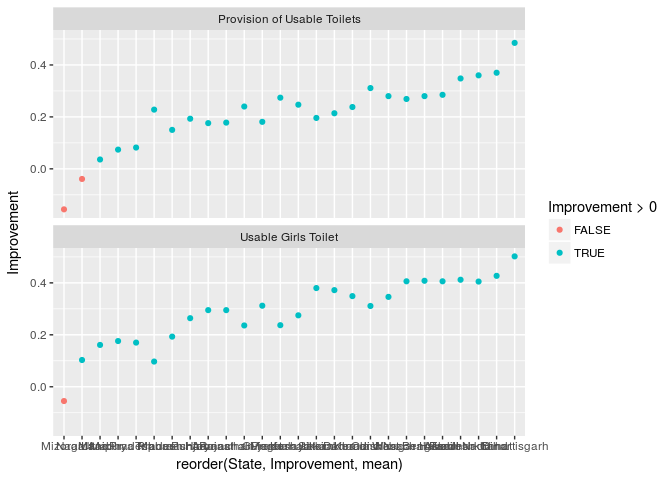
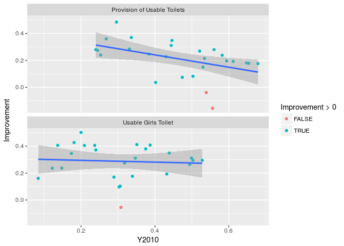
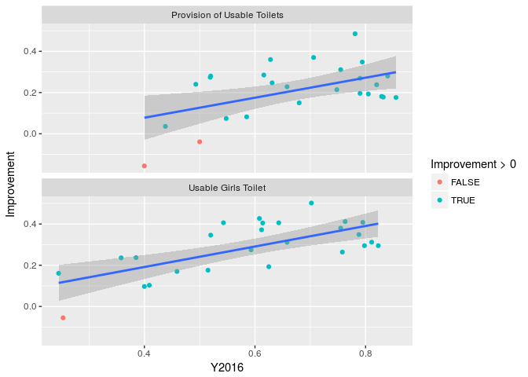
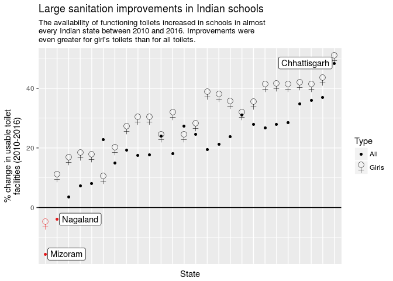

2017 week 32: Toilets in Indian schools
================

It's week 31 of [Makeover Monday](http://www.makeovermonday.co.uk/data/) 2017. The data is about access to sanitation in Indian schools and comes from the [Annual Status of Education Report](http://www.asercentre.org/p/289.html).

    ## Warning: Removed 18 rows containing missing values (geom_point).

    ## Warning: Removed 11 rows containing missing values (geom_path).

    ## Warning: Removed 13 rows containing non-finite values (stat_boxplot).

    ## Warning: Removed 13 rows containing missing values (geom_point).

    ## Warning: Removed 7 rows containing missing values (geom_path).

In general there has been improvement in the percent of toilets that are working since 2010. In addition, the difference between all usable toilets and usable toilets for girls has generally declined since then, meaning that the states are approaching parity between usable toilets for boys and girls.

Looking just at the states with data for 2010 and 2016, almost every single state has improved the state of their toilets in schools.

All states except for 2 made improvements in sanitation. One of the two states saw regression in both all toilets and toilets for girls. The other state only saw regression in overall toilets, but saw improvement in toilets for girls.

There was a negative or flat correlation between the percent of usable toilets in 2010 and the improvement seen between 2010 and 2016. There was a positive correlation between the percent of usable toilets in 2016 and the improvement seen between 2010 and 2016. The latter observation makes sense given that the value in 2016 depends in part on the improvement over that period.

