2017 week 33: Births in the US
================

It's week 33 of [Makeover Monday](http://www.makeovermonday.co.uk/data/) 2017. The data is about the [timing of births in America](https://pudding.cool/2017/05/births/index.html) and comes from the [CDC](https://www.cdc.gov/nchs/data_access/vitalstatsonline.htm).

There are so many interesting variables in this data set! You can look at geographic and temporal variation of

-   mother's age
-   child's gender
-   child's birth weight
-   number of births

<!-- -->

    ## Warning in readLines(file, skip): line 1 appears to contain an embedded nul

    ## Joining, by = "State"

    ## `stat_bin()` using `bins = 30`. Pick better value with `binwidth`.

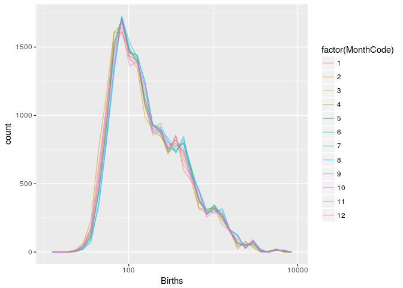

    ## `stat_bin()` using `bins = 30`. Pick better value with `binwidth`.

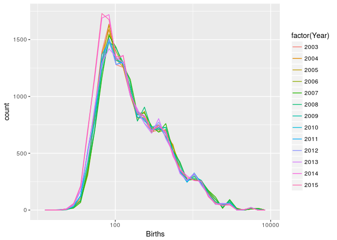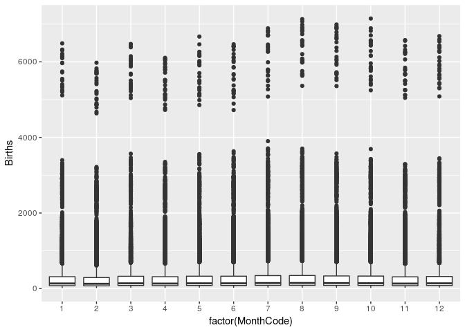

What's up with the weird discontinuity where births are either above or below 4000?

    ## # A tibble: 312 x 13
    ##          Date CountyCode                 County GenderCode Gender
    ##        <date>      <int>                 <fctr>     <fctr> <fctr>
    ##  1 2003-01-01       6037 Los Angeles County, CA          F Female
    ##  2 2003-01-01       6037 Los Angeles County, CA          M   Male
    ##  3 2010-01-01       6037 Los Angeles County, CA          F Female
    ##  4 2010-01-01       6037 Los Angeles County, CA          M   Male
    ##  5 2003-02-01       6037 Los Angeles County, CA          F Female
    ##  6 2003-02-01       6037 Los Angeles County, CA          M   Male
    ##  7 2010-02-01       6037 Los Angeles County, CA          F Female
    ##  8 2010-02-01       6037 Los Angeles County, CA          M   Male
    ##  9 2003-03-01       6037 Los Angeles County, CA          F Female
    ## 10 2003-03-01       6037 Los Angeles County, CA          M   Male
    ## # ... with 302 more rows, and 8 more variables: MonthCode <int>,
    ## #   Month <fctr>, State <fctr>, Year <int>, AverageAgeofMother <dbl>,
    ## #   AverageBirthWeight <dbl>, Births <int>, Abbreviation <fctr>

It turns out to be the data for Los Angeles County, which is apparently unique across the nation for having dramatically more births than any other county.

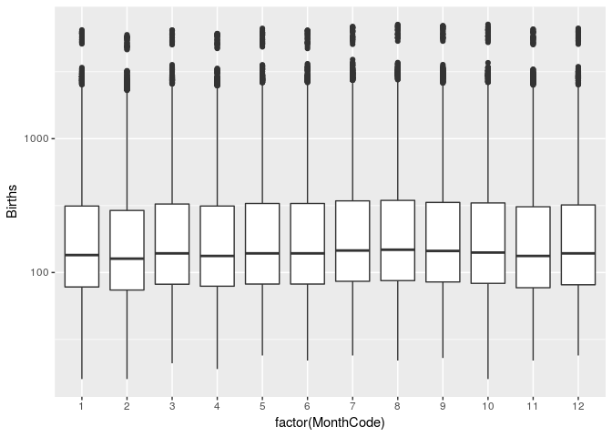

Mother's age
------------

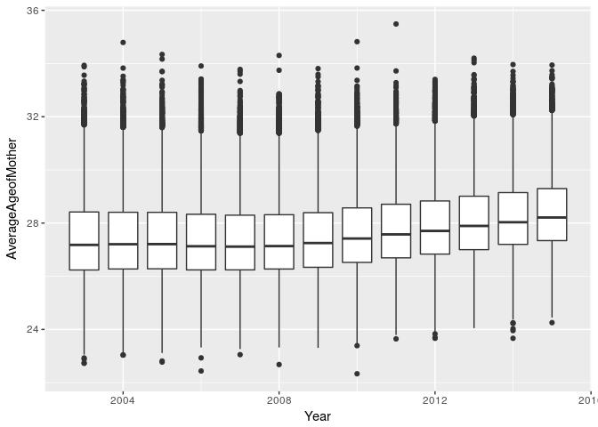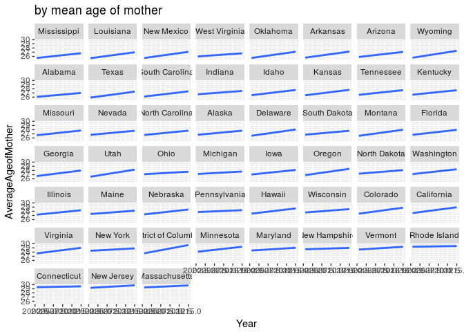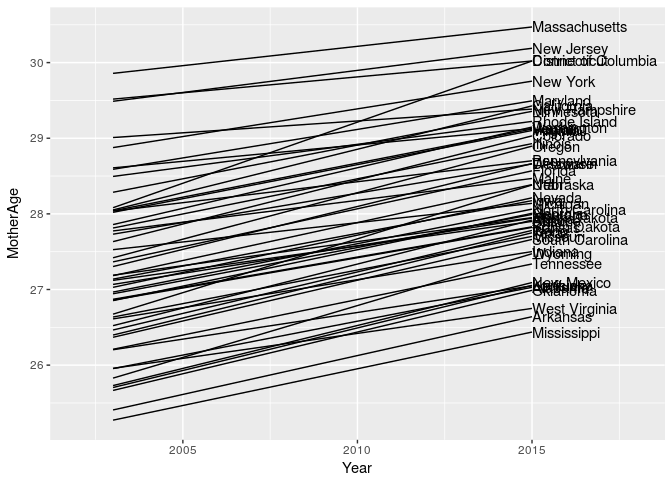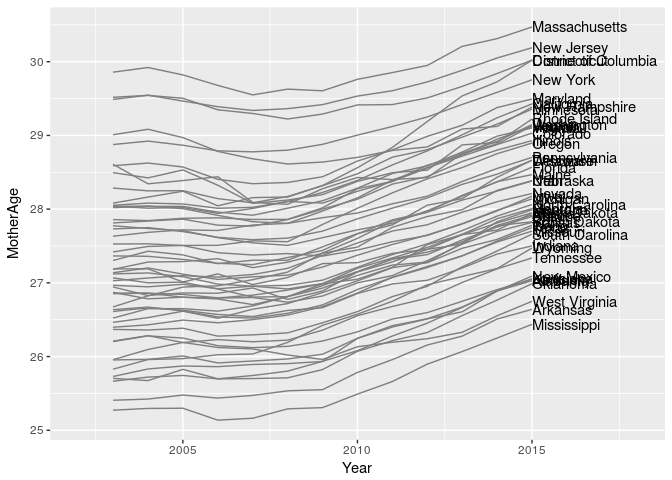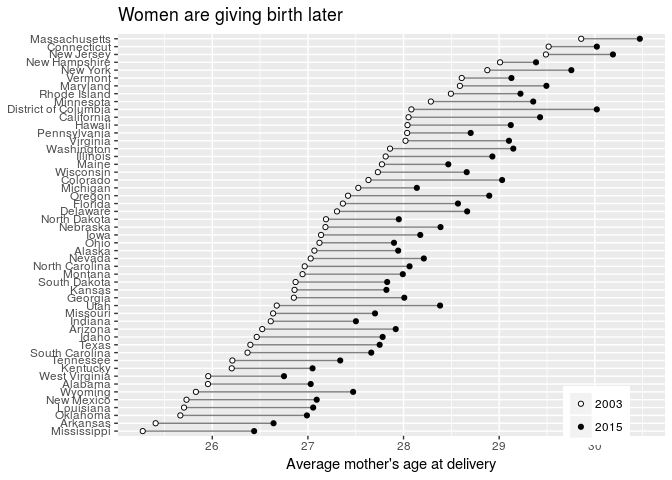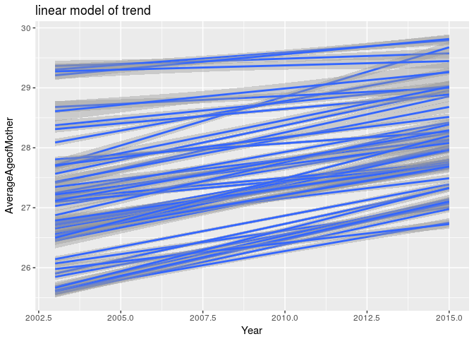

    ## Joining, by = "County"

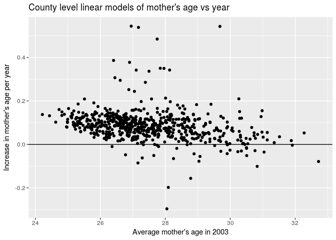

    ## Joining, by = "State"

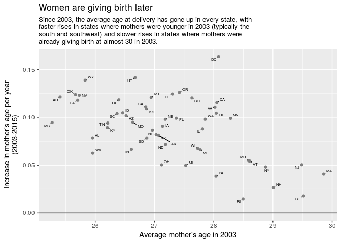

Birth weight
------------

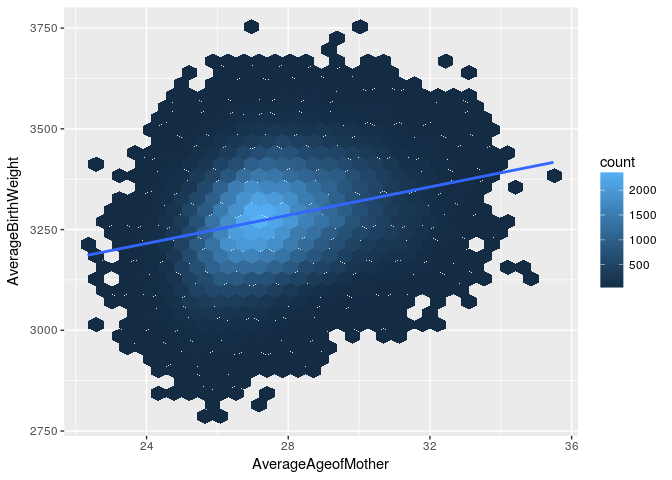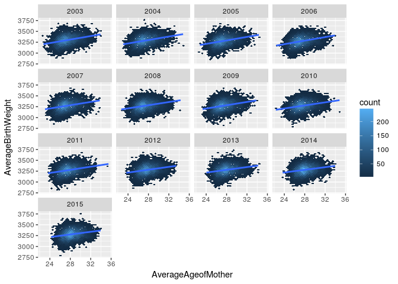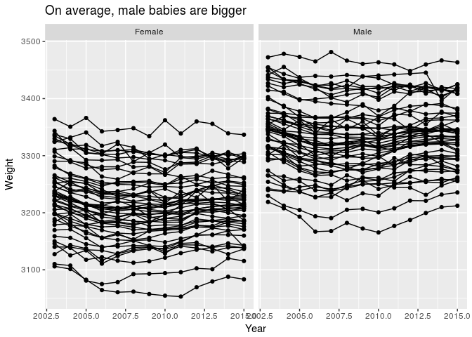

    ## Warning: Ignoring unknown aesthetics: weight

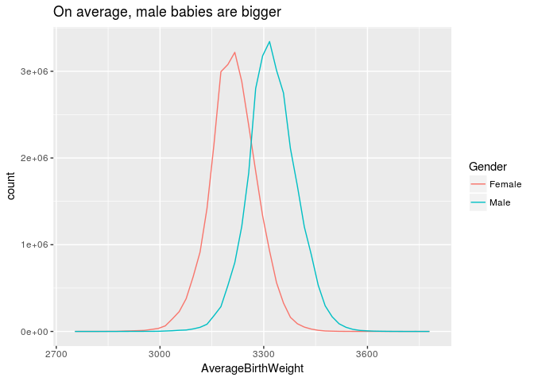

    ## 
    ## Call:
    ## lm(formula = AverageBirthWeight ~ AverageAgeofMother + State + 
    ##     Year + Gender, data = d)
    ## 
    ## Residuals:
    ##     Min      1Q  Median      3Q     Max 
    ## -376.54  -44.26   -0.94   42.30  447.94 
    ## 
    ## Coefficients:
    ##                             Estimate Std. Error t value Pr(>|t|)    
    ## (Intercept)               5745.40928   88.67925  64.789  < 2e-16 ***
    ## AverageAgeofMother          12.88632    0.12766 100.945  < 2e-16 ***
    ## StateAlaska                189.78058    2.99437  63.379  < 2e-16 ***
    ## StateArizona                67.69251    1.71654  39.435  < 2e-16 ***
    ## StateArkansas               52.26765    2.04073  25.612  < 2e-16 ***
    ## StateCalifornia            106.83570    1.31960  80.961  < 2e-16 ***
    ## StateColorado              -21.08318    1.60914 -13.102  < 2e-16 ***
    ## StateConnecticut            72.30470    1.82446  39.631  < 2e-16 ***
    ## StateDelaware               52.32330    2.53038  20.678  < 2e-16 ***
    ## StateDistrict of Columbia  -33.19714    4.08968  -8.117  4.8e-16 ***
    ## StateFlorida                43.32815    1.31491  32.951  < 2e-16 ***
    ## StateGeorgia                 3.79402    1.48547   2.554   0.0106 *  
    ## StateHawaii                 24.73804    2.26920  10.902  < 2e-16 ***
    ## StateIdaho                 114.18347    2.23038  51.195  < 2e-16 ***
    ## StateIllinois               65.20673    1.44396  45.158  < 2e-16 ***
    ## StateIndiana                72.98126    1.47227  49.571  < 2e-16 ***
    ## StateIowa                  119.30637    1.86573  63.946  < 2e-16 ***
    ## StateKansas                 82.15048    2.06302  39.820  < 2e-16 ***
    ## StateKentucky               55.20231    2.17258  25.409  < 2e-16 ***
    ## StateLouisiana             -43.13919    1.58160 -27.276  < 2e-16 ***
    ## StateMaine                 147.01470    1.96300  74.893  < 2e-16 ***
    ## StateMaryland               46.53970    1.60987  28.909  < 2e-16 ***
    ## StateMassachusetts          85.81006    1.64177  52.267  < 2e-16 ***
    ## StateMichigan               90.01079    1.41840  63.460  < 2e-16 ***
    ## StateMinnesota             135.23441    1.73021  78.161  < 2e-16 ***
    ## StateMississippi           -37.34518    1.95752 -19.078  < 2e-16 ***
    ## StateMissouri               74.10555    1.66991  44.377  < 2e-16 ***
    ## StateMontana                78.80907    2.90121  27.164  < 2e-16 ***
    ## StateNebraska              104.15200    2.26695  45.944  < 2e-16 ***
    ## StateNevada                 26.40967    2.53018  10.438  < 2e-16 ***
    ## StateNew Hampshire         131.98597    2.10446  62.717  < 2e-16 ***
    ## StateNew Jersey             38.42507    1.46555  26.219  < 2e-16 ***
    ## StateNew Mexico              0.43319    2.06189   0.210   0.8336    
    ## StateNew York               74.25701    1.37161  54.139  < 2e-16 ***
    ## StateNorth Carolina         50.84422    1.37794  36.899  < 2e-16 ***
    ## StateNorth Dakota          137.39639    2.99632  45.855  < 2e-16 ***
    ## StateOhio                   64.52391    1.35064  47.773  < 2e-16 ***
    ## StateOklahoma               64.16599    2.06186  31.120  < 2e-16 ***
    ## StateOregon                143.49201    1.68037  85.393  < 2e-16 ***
    ## StatePennsylvania           72.92734    1.34017  54.416  < 2e-16 ***
    ## StateRhode Island           93.99807    2.28942  41.058  < 2e-16 ***
    ## StateSouth Carolina         18.25479    1.51057  12.085  < 2e-16 ***
    ## StateSouth Dakota          121.81559    2.90119  41.988  < 2e-16 ***
    ## StateTennessee              41.04370    1.59282  25.768  < 2e-16 ***
    ## StateTexas                  37.06899    1.30230  28.464  < 2e-16 ***
    ## StateUtah                   51.07691    2.04340  24.996  < 2e-16 ***
    ## StateVermont               144.91307    3.00854  48.167  < 2e-16 ***
    ## StateVirginia               32.50508    1.52794  21.274  < 2e-16 ***
    ## StateWashington            153.92240    1.59803  96.320  < 2e-16 ***
    ## StateWest Virginia          36.64638    2.89987  12.637  < 2e-16 ***
    ## StateWisconsin             112.71977    1.54310  73.048  < 2e-16 ***
    ## StateWyoming               -10.49160    4.08043  -2.571   0.0101 *  
    ## Year                        -1.46429    0.04452 -32.894  < 2e-16 ***
    ## GenderMale                 114.52227    0.32564 351.681  < 2e-16 ***
    ## ---
    ## Signif. codes:  0 '***' 0.001 '**' 0.01 '*' 0.05 '.' 0.1 ' ' 1
    ## 
    ## Residual standard error: 69.28 on 181002 degrees of freedom
    ## Multiple R-squared:  0.5499, Adjusted R-squared:  0.5498 
    ## F-statistic:  4172 on 53 and 181002 DF,  p-value: < 2.2e-16

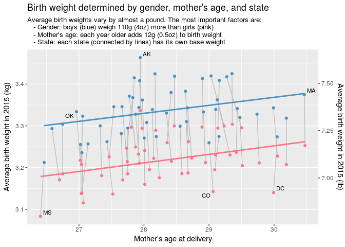

Birth seasonality
-----------------

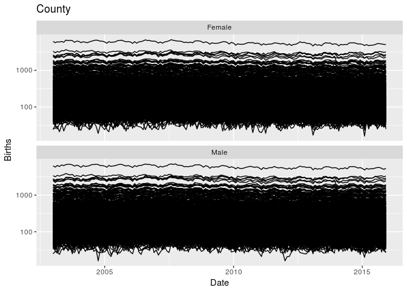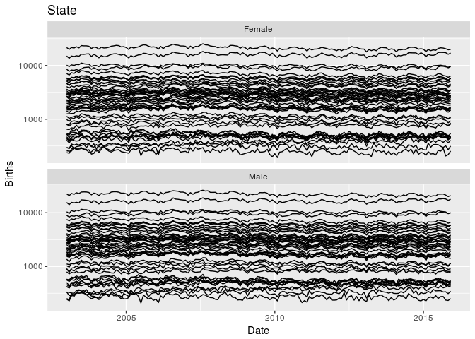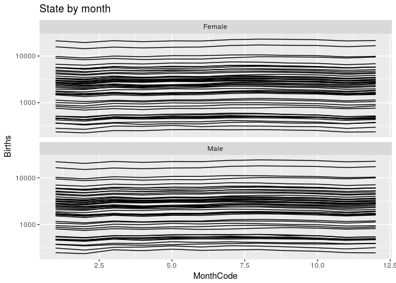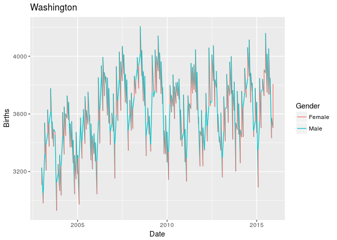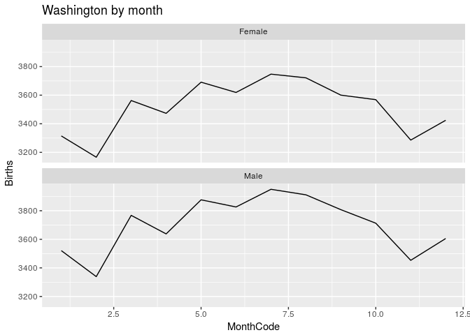

Gender
------

    ## `geom_smooth()` using method = 'gam'

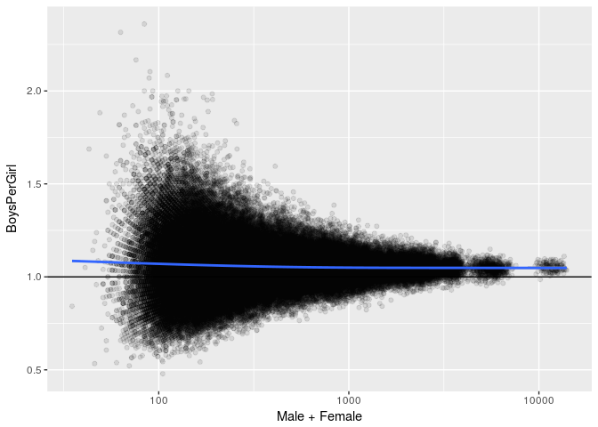
