2017 week 36: My World Survey
================

It's week 36 of [Makeover Monday](http://www.makeovermonday.co.uk/data/) 2017 edition. This week is a special challenge with the [My World Survey](http://data.myworld2030.org/).

Demographics
============

Goal 1: Understand demographics of survey respondents, in reference to [this figure from My World 2015](http://data.myworld2015.org/).

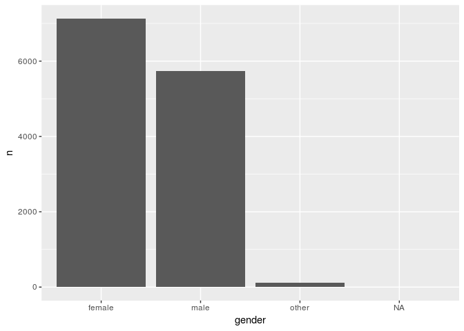

    ## Warning: Removed 1 rows containing missing values (position_stack).

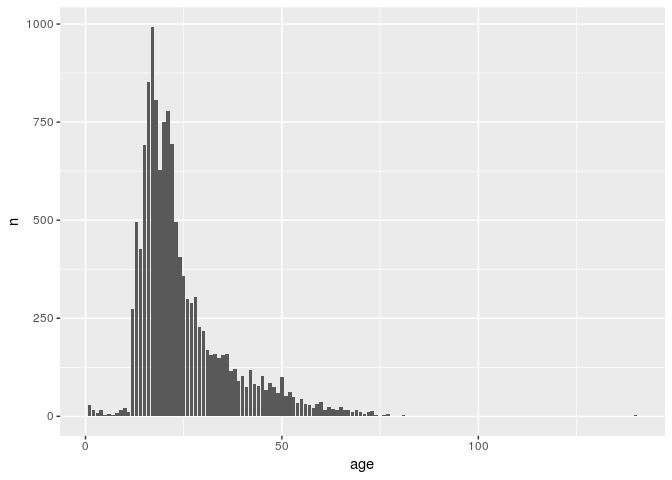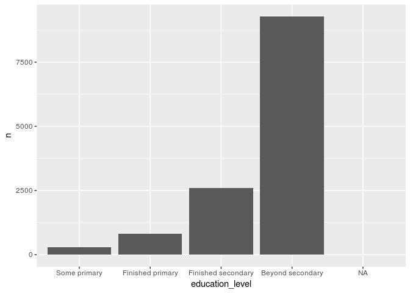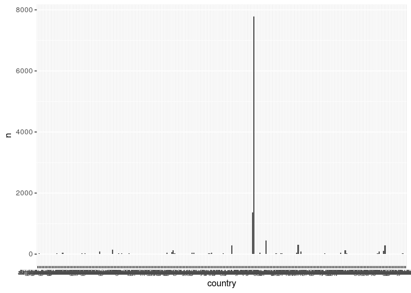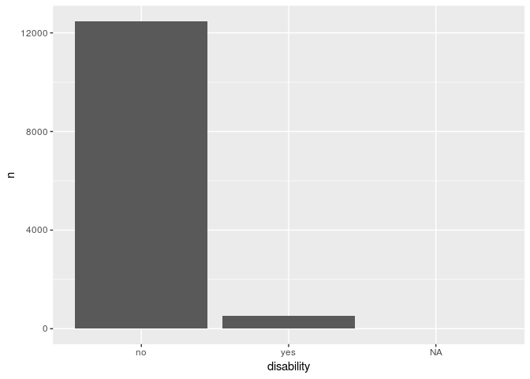

Gender
------

The world is 49.55% female in 2015 (<https://data.worldbank.org/indicator/SP.POP.TOTL.FE.ZS>). 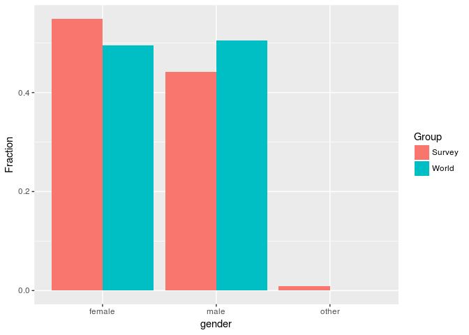

Males are somewhat underrepresented.

Education
---------

Wittgenstein educational attainment projections for 2015 (<http://databank.worldbank.org/data/reports.aspx?source=education-statistics-~-all-indicators>) :

-   "Some primary" = 10%
-   "Finished primary" = 20% + 20% for some secondary
-   "Finished secondary" = 30%
-   "Beyond secondary" = 10%

(doesn't sum to 100)

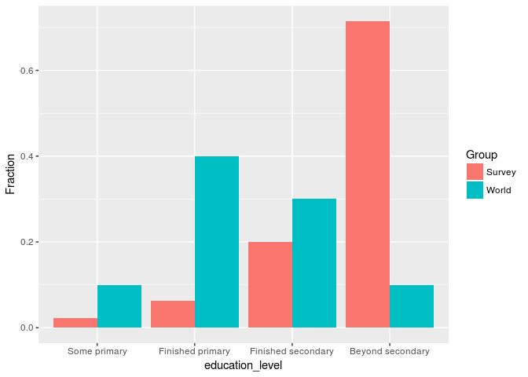

World age distribution 2017 (<https://www.census.gov/population/international/data/idb/worldpop.php>) saved to file

Age
---

    ## Parsed with column specification:
    ## cols(
    ##   Age = col_character(),
    ##   Population = col_integer()
    ## )

    ## Joining, by = "Age"

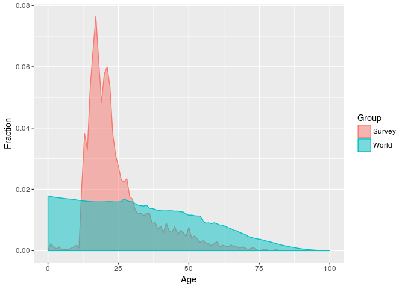

The survey population is very different by age than the world population by age!

Disability
----------

In 2011 the [WHO estimated](http://www.who.int/disabilities/world_report/2011/report/en/) that "About 15% of the world's population lives with some form of disability, of whom 2-4% experience significant difficulties in functioning", up from 10% in 1970.

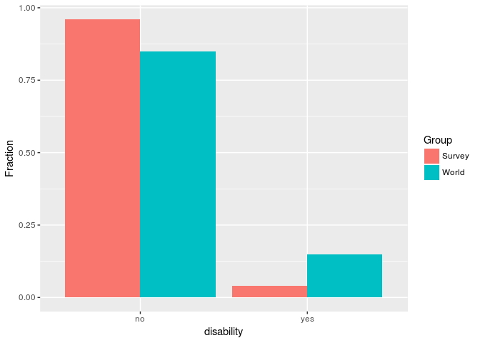

Country
-------

    ## Joining, by = "country"

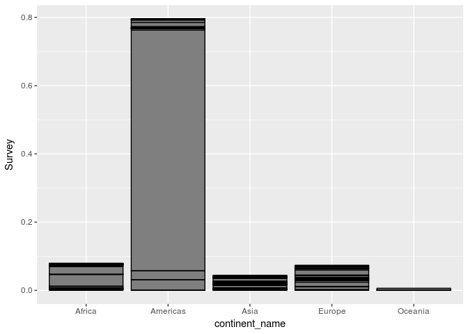

    ## Joining, by = "country"

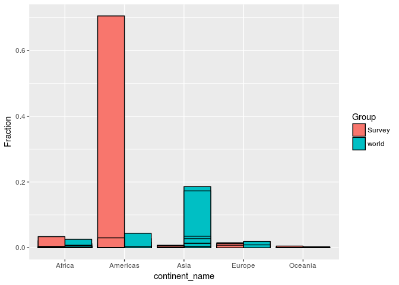

survey data is 70% from Mexico!
