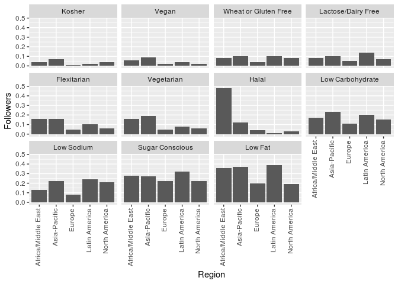
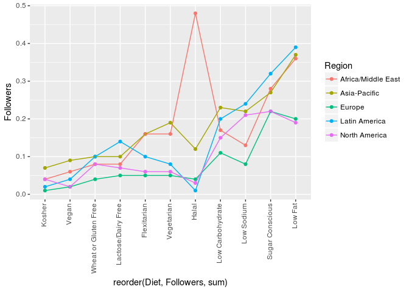
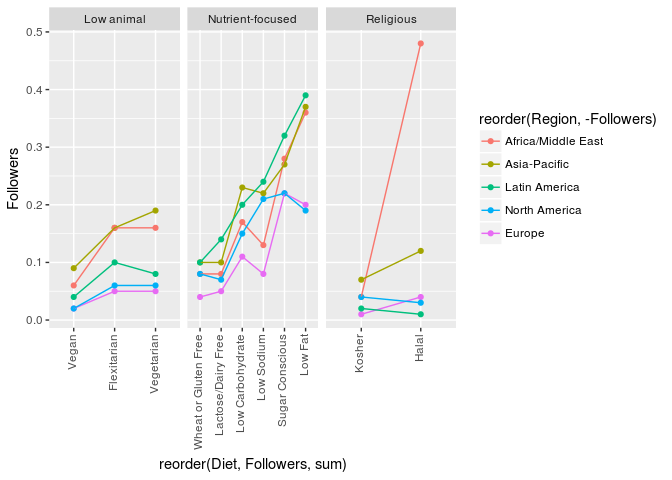
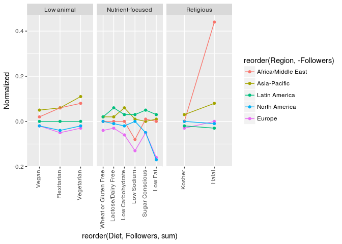
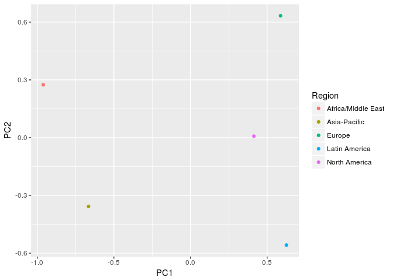
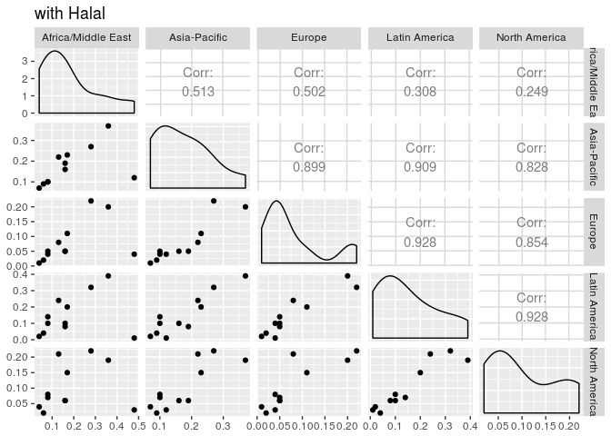
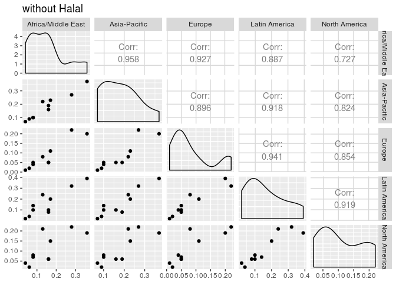
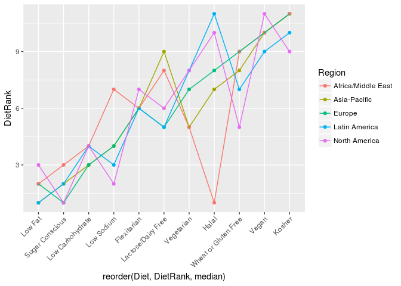
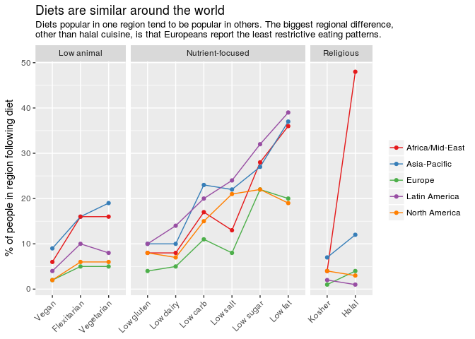

2017 week 39: Food Fashions
================

It's week 39 of [Makeover Monday](http://www.makeovermonday.co.uk/data/) 2017. This week focuses on food trends, with data from [nielsen](http://www.nielsen.com/content/dam/nielsenglobal/eu/docs/pdf/Global%20Ingredient%20and%20Out-of-Home%20Dining%20Trends%20Report%20FINAL%20(1).pdf).

The most popular dietary fashions are for nutrient restriction: low carb/salt/sugar/fat. Europe in general seems to be lower than the others in most cases. The most dramatic difference across countries is in the Halal category.

This shows more clearly that Europe tends to be lowest in most categories, with North America typically following next. Asia-Pacific and Latin America are on the higher ends of things.

Dividing it into groups like this gives a little more context.

This shows it normalized, with the value for each regions/diet subtracted by the median value (across regions), so positive numbers mean more prominent than the median and negative mean less prominent.

    ##                    Africa/Middle East Asia-Pacific    Europe Latin America
    ## Africa/Middle East          1.0000000    0.5132234 0.5016659     0.3084514
    ## Asia-Pacific                0.5132234    1.0000000 0.8994633     0.9092715
    ## Europe                      0.5016659    0.8994633 1.0000000     0.9279550
    ## Latin America               0.3084514    0.9092715 0.9279550     1.0000000
    ## North America               0.2488196    0.8280031 0.8538522     0.9275021
    ##                    North America
    ## Africa/Middle East     0.2488196
    ## Asia-Pacific           0.8280031
    ## Europe                 0.8538522
    ## Latin America          0.9275021
    ## North America          1.0000000

    ## Warning: replacing previous import by 'utils::capture.output' when loading
    ## 'GGally'

    ## Warning: replacing previous import by 'utils::head' when loading 'GGally'

    ## Warning: replacing previous import by 'utils::installed.packages' when
    ## loading 'GGally'

    ## Warning: replacing previous import by 'utils::str' when loading 'GGally'

Weak correlation between Africa/Middle East with other regions is based on Halal diet outlier. If you remove that category, the correlations are very strong across all regions.

Final version: 
